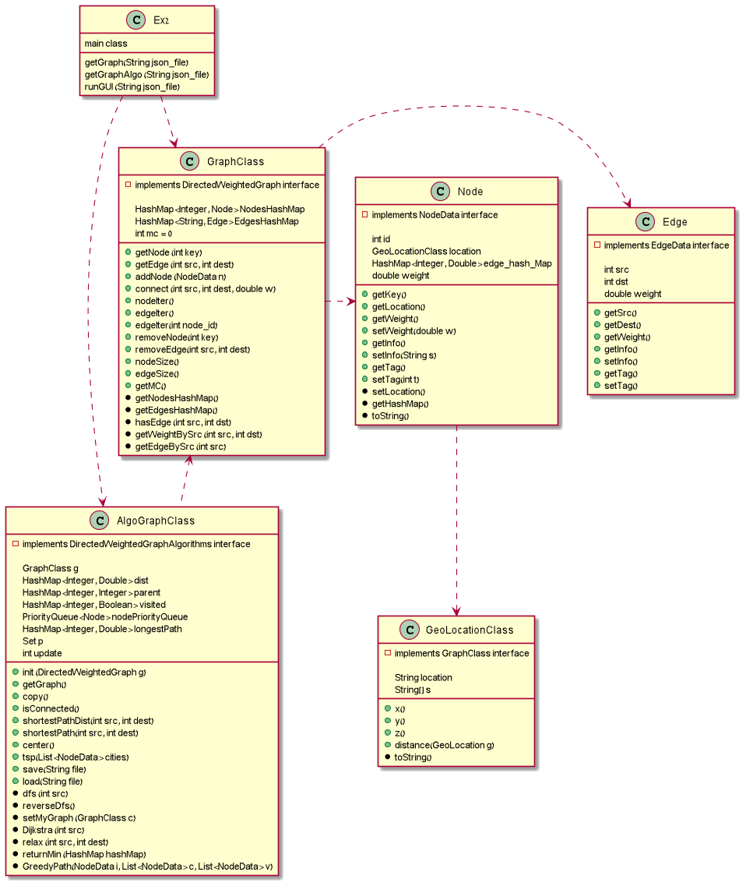

# Ex2

@auther Ofir Regev, Ofek Avi Saadon, Elhai Agassi

*introduction*

This project is about directed weighted graphs.
Directed weighted graphs are (simple) directed graphs with weights assigned to their arrows.

We asked to implement interfaces of directed weighted graphs and of directed weighted graphs algorithms, and to represent the graphs by GUI presentation.

The graph needs to be load from a json file, we used json_simple.jar library.

*Project Materials*

For understanding all the problem space we assisted the videos of William Fiset and wikipedia:

https://www.youtube.com/channel/UCD8yeTczadqdARzQUp29PJw
https://en.wikipedia.org/wiki/Directed_graph
https://en.wikipedia.org/wiki/Graph_center
https://en.wikipedia.org/wiki/Dijkstra%27s_algorithm

Also, for few of the algorithms implementations we assisted GeeksForGeeks and StackOverFlow forums.
https://www.geeksforgeeks.org/
https://stackoverflow.com/

*UML of the classes in the project*

This uml represent the main classes in the project, every class (except Ex2) implement interface that has been given as part of the assignment.

The green points means functions from the interface, and the black points means that this is a function that added by me for the project.

The dashed line means that this class depends on the other class.

*Explanation on the classes and the interfaces*

-Ex2-

Above all there is the Ex2 class, which is the main class of the project.

Ex2 get json file and create a graph, this graph implements by the algorithms graph, and the function runGui create GUI presentation of this algorithms graph.

In the GUI presentation yoe can create new graphs and run the algorithms on.

-GraphClass-

The interface DirectedWeightedGraph 
    
    * returns the node_data by the node_id,
    * @param key - the node_id
    * @return the node_data by the node_id, null if none.
    
public NodeData getNode(int key);

    * returns the data of the edge (src,dest), null if none.
    * Note: this method should run in O(1) time.
    * @param src
    * @param dest
    * @return

public EdgeData getEdge(int src, int dest);

    * adds a new node to the graph with the given node_data.
    * Note: this method should run in O(1) time.
    * @param n

public void addNode(NodeData n);

    * Connects an edge with weight w between node src to node dest.
    * * Note: this method should run in O(1) time.
    * @param src - the source of the edge.
    * @param dest - the destination of the edge.
    * @param w - positive weight representing the cost (aka time, price, etc) between src-->dest.
      
  public void connect(int src, int dest, double w);
  
    * This method returns an Iterator for the
    * collection representing all the nodes in the graph.
    * Note: if the graph was changed since the iterator was constructed - a RuntimeException should be thrown.
    * @return Iterator<node_data>

public Iterator<NodeData> nodeIter();
      
    * This method returns an Iterator for all the edges in this graph.
    * Note: if any of the edges going out of this node were changed since the iterator was constructed - a RuntimeException should be thrown.
    * @return Iterator<EdgeData>
     
public Iterator<EdgeData> edgeIter();
      
    * This method returns an Iterator for edges getting out of the given node (all the edges starting (source) at the given node).
    * Note: if the graph was changed since the iterator was constructed - a RuntimeException should be thrown.
    * @return Iterator<EdgeData>
     
public Iterator<EdgeData> edgeIter(int node_id);

 
    * Deletes the node (with the given ID) from the graph -
    * and removes all edges which starts or ends at this node.
    * This method should run in O(k), V.degree=k, as all the edges should be removed.
    * @return the data of the removed node (null if none).
    * @param key
     
public NodeData removeNode(int key);
      
    * Deletes the edge from the graph,
    * Note: this method should run in O(1) time.
    * @param src
    * @param dest
    * @return the data of the removed edge (null if none).
     
public EdgeData removeEdge(int src, int dest);

     *Returns the number of vertices (nodes) in the graph.
     * Note: this method should run in O(1) time.
     * @return
      
public int nodeSize();
      
    * Returns the number of edges (assume directional graph).
    * Note: this method should run in O(1) time.
    * @return
     
public int edgeSize();
     
    * Returns the Mode Count - for testing changes in the graph.
    * @return
      
public int getMC();

----------------------------------------------------------------------------end of the interface---------------------------------------------------------------------------------------------------------

We chose to implement the graph data structure by two hash maps, one save nodes by their id (each node have his own hash map that saves the destination of the edge that get from it and the edge weight).
The second hash map is a hash map for edges, it saves edge by string (e.g "1,8") and the weight of the edge.

-AlgoGraphClass-

The interface of DirectedWeightedGraphAlgorithms 

    * Inits the graph on which this set of algorithms operates on.
    * @param g

public void init(DirectedWeightedGraph g);

    
     * Returns the underlying graph of which this class works.
     * @return
     
public DirectedWeightedGraph getGraph();
    
     * Computes a deep copy of this weighted graph.
     * @return
     
public DirectedWeightedGraph copy();
    
     * Returns true if and only if (iff) there is a valid path from each node to each
     * other node. NOTE: assume directional graph (all n*(n-1) ordered pairs).
     * @return
     
public boolean isConnected();
    
     * Computes the length of the shortest path between src to dest
     * Note: if no such path --> returns -1
     * @param src - start node
     * @param dest - end (target) node
     * @return
     
public double shortestPathDist(int src, int dest);
    
     * Computes the the shortest path between src to dest - as an ordered List of nodes:
     * src--> n1-->n2-->...dest
     * see: https://en.wikipedia.org/wiki/Shortest_path_problem
     * Note if no such path --> returns null;
     * @param src - start node
     * @param dest - end (target) node
     * @return
     
public List<NodeData> shortestPath(int src, int dest);

    
     * Finds the NodeData which minimizes the max distance to all the other nodes.
     * Assuming the graph isConnected, elese return null. See: https://en.wikipedia.org/wiki/Graph_center
     * @return the Node data to which the max shortest path to all the other nodes is minimized.
     
public NodeData center();

    * Computes a list of consecutive nodes which go over all the nodes in cities.
    * the sum of the weights of all the consecutive (pairs) of nodes (directed) is the "cost" of the solution -
    * the lower the better.
    * See: https://en.wikipedia.org/wiki/Travelling_salesman_problem

List<NodeData> tsp(List<NodeData> cities);

    * Saves this weighted (directed) graph to the given
    * file name - in JSON format
    * @param file - the file name (may include a relative path).
    * @return true - iff the file was successfully saved

public boolean save(String file);

    
     * This method loads a graph to this graph algorithm.
     * if the file was successfully loaded - the underlying graph
     * of this class will be changed (to the loaded one), in case the
     * graph was not loaded the original graph should remain "as is".
     * @param file - file name of JSON file
     * @return true - iff the graph was successfully loaded.
     
public boolean load(String file);

----------------------------------------------------------------------------end of the interface-------------------------------------------------------------------------------------------------------

Because of the fact that we needed to use many algorithms to implements this class we assisted many data structure.
GraphClass g - The graph which the algorithms in this class are run on.
    
HashMap<Integer, Double> dist - saving the shortest path for every node in the graph.
    
HashMap<Integer, Integer> parent - saving the last node that pointed to the node, this hash map is for the shortestPath function.
    
HashMap<Integer, Boolean> visited - saving the data about the node processing (true if it already processed else false), this hash map is mainly for the isConnected function.
    
PriorityQueue<Node> nodePriorityQueue - for the Dijkstra function, return every time the node with the minimal weight.
    
HashMap<Integer, Double> longestPath - saving the longest path of each node, this hash map is for the center function.
    
Set p - for the Dijkstra function.
    
int update - for the shortestPathDist function.

Running time for G1 graph
is connected = 4 ms
center= 32 ms
shortest path (1,16) = 9 ms

Running time for G2 graph
is connected = 4 ms
center = 36 ms
shortest path (1,30) =7  ms

Running time for G3 graph
is connected = 5 ms
center = 68 ms
shortest path (1,47) =11  ms
    
Running time for 1000 nodes graph
is connected = 6 ms
center = 46 ms
shortest path (1,999) = 2 ms

Running time for 10000 nodes graph
is connected =  timeout
center = timeout
    
We couldn't run the program for the bigger graphs because of the size of the file.
    
*How to open the jar file*
    
    
-download the jar file from the github
    
-open new java project
    
-add to the src pacage the jar file
    
-add the files which you want to load
    
-open a new terminal fron the jar file, like that:

    
    
    
-write this :java -jar Ex2.jar filename.json in the terminal
    
-press enter
    
 -enjoy (:

